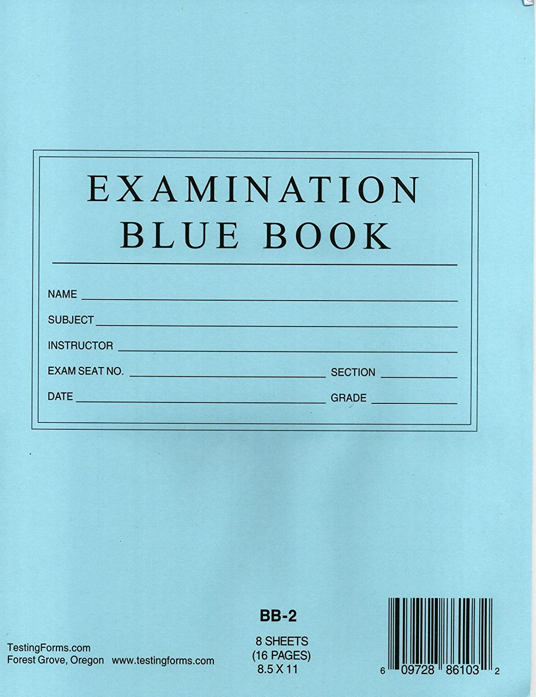

=======================
The Runestone Blue Book
=======================

.. Here is were you specify the content and order of your new book.

.. Each section heading (e.g. "SECTION 1: A Random Section") will be
   a heading in the table of contents. Source files that should be
   generated and included in that section should be placed on individual
   lines, with one line separating the first source filename and the
   :maxdepth: line.

.. Sources can also be included from subfolders of this directory.
   (e.g. "DataStructures/queues.rst").

           
Why a Blue Book?
================

Some instructors want a book with no existing content that they can simply customize by creating their own assignments and exams.  This is that book and hence the name Blue Book.  I have edited this on github now. And again. Three!!! Four!

.. toctree::
   :maxdepth: 2
   :numbered:

   Exams/toctree.rst

The End.
